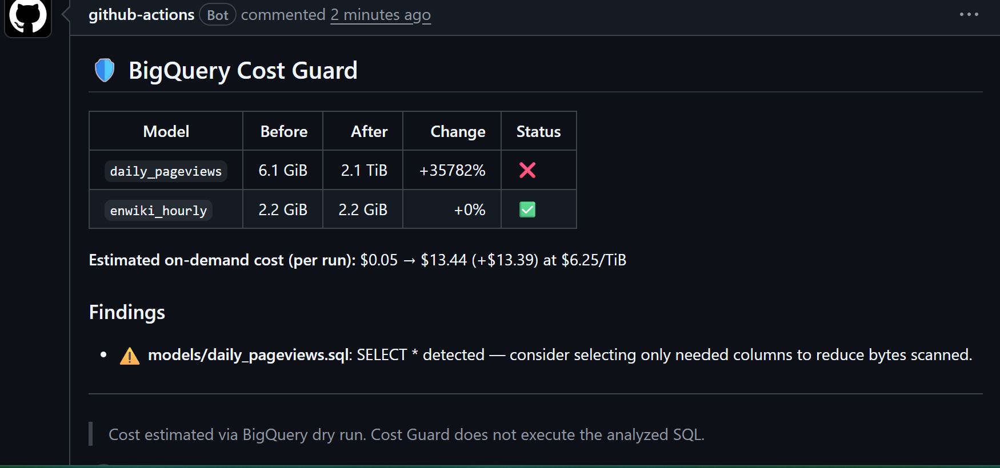

# BigQuery PR Cost Guard

**Catch BigQuery cost regressions in the pull request — before they hit your bill.**

A partition filter disappears in a PR, and a query that scanned 4.2 GiB now scans
94.7 GiB *on every run*. BigQuery PR Cost Guard dry-runs your changed dbt / BigQuery
SQL on each Pull Request and comments the cost impact — so the regression is caught
at review time instead of on the invoice.



- **Shift-left** — runs in CI on every PR, not a dashboard you must remember to open.
- **Dry run only** — Cost Guard never executes the analyzed SQL ([details](#7-security-model)).
- **No stored keys** — auth via GitHub OIDC → Google Workload Identity Federation.
- **No server, ~$0 fixed cost** — runs in your GitHub Actions, against your BigQuery.

> **Free during beta.** Team features planned — merge blocking on cost regressions,
> organization-wide policies, repository budgets. Want them? Open a GitHub
> Discussion / Issue to join early access.

### Quick start (target: first comment in under 15 minutes)

```text
1. Configure Google Workload Identity Federation:
   ./scripts/setup-gcp.sh --project <gcp-project-id> --repo <org/repo>
2. Add .github/workflows/bq-cost-guard.yml   (copy from examples/)
3. Open a Pull Request
```

No always-on server, no stored GCP keys, effectively $0 fixed cost.

---

## 1. What is BigQuery PR Cost Guard?

A GitHub Action that, on every Pull Request:

1. Finds changed `*.sql` files (dbt `models/**/*.sql` prioritised).
2. Compiles your dbt project (if present).
3. Runs a **BigQuery dry run** to estimate bytes scanned — reads table metadata
   only, never row data, and never executes the analyzed SQL.
4. Runs lightweight static analysis (`SELECT *`, `CROSS JOIN`, ...).
5. Posts a single, self-updating comment summarising the cost impact.

Everything runs inside **your own** GitHub Actions runner against **your own**
BigQuery project. There is no SaaS backend in the box.

## 2. Example PR comment

```markdown
<!-- bq-cost-guard -->

## 🛡 BigQuery Cost Guard

| Model | Before | After | Change | Status |
|---|---:|---:|---:|---|
| `orders_daily` | 4.2 GiB | 94.7 GiB | +2155% | ⚠️ |
| `customers`    | 1.8 GiB | 1.9 GiB  | +5%    | ✅ |

**Estimated on-demand cost (per run):** $0.04 → $0.57 (+$0.53) at $6.25/TiB

### Findings

- ⚠️ **models/orders_daily.sql**: SELECT * detected — consider selecting only needed columns to reduce bytes scanned.

---
> Cost estimated via BigQuery dry run. Cost Guard does not execute the analyzed SQL.
```

> **Before/After** is computed by compiling and dry-running both the PR base and
> head (Phase 1B). If the base cannot be compiled (or on a fork PR, where no
> credentials are used), the comment falls back to the head estimate with
> `Before`/`Change` as `N/A`. The cost line appears only when
> `pricing.price_per_tib_usd` is set.

## 3. Quick Start

```bash
# 1. One-time GCP setup (creates WIF pool, provider, SA, minimum IAM)
./scripts/setup-gcp.sh my-gcp-project my-org/my-repo
# -> prints GCP_WIF_PROVIDER and GCP_SERVICE_ACCOUNT

# 2. Add those two as GitHub repo Variables, then add the workflow:
cp examples/github-workflow.yml .github/workflows/bq-cost-guard.yml

# 3. (optional) tune thresholds
cp examples/.bq-cost-guard.yml .bq-cost-guard.yml
```

Open a PR that edits a `.sql` file — the comment appears automatically.

## 4. GitHub Permissions

```yaml
permissions:
  contents: read         # checkout + diff
  pull-requests: write   # post / update the cost comment
  id-token: write        # mint the OIDC token for Workload Identity Federation
```

Grant nothing beyond these.

## 5. Google Cloud WIF Setup

No Service Account JSON key is used. Authentication is GitHub OIDC → Google
Workload Identity Federation → short-lived Service Account impersonation.

Run `./scripts/setup-gcp.sh <PROJECT_ID> <ORG/REPO>` or follow the manual steps
in [docs/gcp-setup.md](docs/gcp-setup.md). Then set the workflow inputs:

```yaml
with:
  workload_identity_provider: ${{ vars.GCP_WIF_PROVIDER }}
  service_account: ${{ vars.GCP_SERVICE_ACCOUNT }}
```

## 6. Required Google IAM permissions

Dry run needs only to submit a job and read table metadata:

| Role | Why |
|---|---|
| `roles/bigquery.jobUser` | bundles `bigquery.jobs.create` — submit the dry-run job |
| `roles/bigquery.dataViewer` | read table schema / partitioning for the estimate |

It does **not** need any write/edit role, and dry run reads **no row data**. For
tighter scope, grant `dataViewer` on only the datasets your models read. Details
in [docs/gcp-setup.md](docs/gcp-setup.md).

## 7. Security Model

- **No long-lived GCP keys** — WIF issues short-lived, repo-scoped credentials.
- **Nothing leaves your environment** — runs on your runner, your BigQuery, your
  PR; no third-party backend in Phase 1.
- **Cost Guard does not execute the analyzed SQL** — its BigQuery client is only
  ever called with `dry_run=True`; there is no query-execution code path in Cost
  Guard itself.
- **No secrets logged** — SQL, tokens, and credentials are never written to logs.

### Important caveat: `dbt compile` can run queries

Cost Guard runs `dbt compile` to resolve your models. dbt itself can execute real
queries during compilation — `on-run-start` / `on-run-end` hooks run on compile,
and macros can call `run_query()`. These are **your project's code**, outside Cost
Guard's dry-run client. So:

- The accurate claim is *"Cost Guard does not execute the analyzed SQL"*, **not**
  *"no query ever runs"*. Review your dbt project's compile-time behavior yourself.
- Fork-PR protection is **necessary but not sufficient**: a **same-repo** PR could
  add `` or a hook, which would run under your service
  account during compile. Treat same-repo PR review as a trust boundary, keep the
  service-account IAM minimal and read-only (`jobUser` + `dataViewer`), and
  consider requiring approval before CI runs on a branch.

Full details: [docs/security.md](docs/security.md).

## 8. Fork PR behavior

PR code from a **fork is untrusted**, so:

- Fork PRs **never** get GCP credentials and **never** run a BigQuery dry run.
  Only **static analysis** runs, and the comment says so.
- The workflow uses the plain `pull_request` event. `pull_request_target`
  (which would run fork code with secrets) is deliberately **not** used.
- Note: this protects against *fork* code. See the `dbt compile` caveat in the
  Security Model above for the residual *same-repo* risk.

See [docs/security.md](docs/security.md#2-fork-pr-safety-the-most-important-control).

## 9. Configuration

Place `.bq-cost-guard.yml` at the repo root. Every field is optional; defaults
apply when the file or a field is missing.

```yaml
version: 1
fail_on_threshold: false        # default: warning-only (do not fail the job)

dbt:
  project_dir: "."
  profiles_dir: "."

bigquery:
  project_id: "my-project"
  location: "US"

thresholds:
  warn_bytes: 53687091200       # 50 GiB
  fail_bytes: 536870912000      # 500 GiB
  warn_increase_percent: 50     # used by Phase 1B Before/After
  fail_increase_percent: 200

analysis:
  detect_select_star: true
  detect_missing_partition_filter: true

pricing:
  price_per_tib_usd: null       # set your rate to also show estimated $; no price is hard-coded
```

See [examples/.bq-cost-guard.yml](examples/.bq-cost-guard.yml).

## 10. BigQuery Dry Run limitations

Dry-run estimates are **upper-bound estimates of bytes scanned**, not a billing
guarantee. They can differ from actual cost for:

- **External tables** (e.g. federated / BigLake sources)
- **Row-level / column-level security** policies
- Some **dynamic SQL** and scripting
- **UDFs / remote functions**
- **On-demand vs. capacity (flat-rate) pricing** — bytes scanned maps to cost
  only under on-demand pricing

For this reason the primary metric is **bytes processed**, and no dollar price is
hard-coded (set `pricing.price_per_tib_usd` if you want an estimate).

## 11. Local Development

```bash
python -m venv .venv && source .venv/bin/activate
pip install -e ".[dev]"

# Static-analyse a single SQL file
bq-cost-guard analyze --sql-file tests/fixtures/select_star.sql

# Add --project-id to also perform a dry run (needs GCP credentials locally)
bq-cost-guard analyze --sql-file path/to/model.sql --project-id my-project
```

## 12. Tests

```bash
pip install -e ".[dev]"
pytest
```

Tests run **without** any real GCP or GitHub credentials — BigQuery and GitHub
access are isolated behind functions and are not exercised by the unit tests.

## 13. Architecture

```text
PR -> GitHub Actions -> dbt compile -> WIF auth -> BigQuery Dry Run -> PR comment
```

All heavy work runs in the customer's GitHub Actions, keeping fixed cost at ~$0
and keeping credentials inside the customer's org. Full diagram and the Phase 2
serverless control-plane sketch: [docs/architecture.md](docs/architecture.md).

## 14. Cost

**Phase 1 has no fixed infrastructure cost.** It consumes only GitHub Actions
minutes (free tier covers typical usage for public repos and small teams) and
BigQuery **dry runs, which are not billed for bytes scanned**. There is no
always-on server.

Any future SaaS control plane (Phase 2) is designed to stay serverless (Lambda
Function URL + SQS + DynamoDB, no VPC/NAT/RDS). This project does not hard-code
any cloud prices — consult the official
[Google BigQuery pricing](https://cloud.google.com/bigquery/pricing) and
[AWS pricing](https://aws.amazon.com/pricing/) pages for current rates.

## 15. Roadmap

Phase 1 (MVP) ships head-only estimates; Phase 1B adds Before/After comparison;
Phase 2 is an optional, serverless SaaS control plane — built only if Phase 1
proves useful. Full list: [docs/roadmap.md](docs/roadmap.md).

---

Licensed under the [MIT License](LICENSE).
